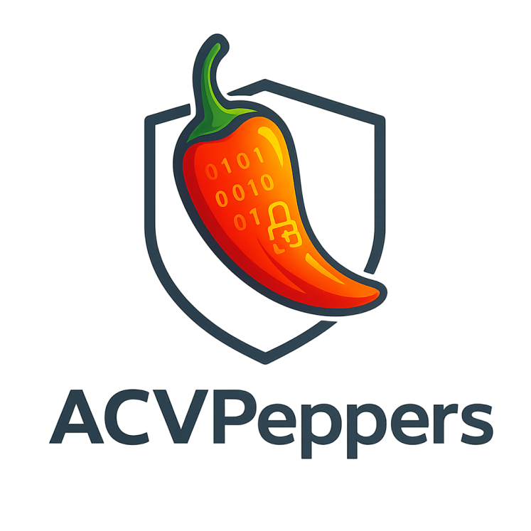

# ACVPeppers

<p align="center">
  
</p>

ACVPeppers is a Rust client for running cryptographic tests against the NIST ACVP server.

## Quick start

```bash
cargo build --release
cargo run -- --config acvp.toml config --show
```

Run ACVP tests with:

```bash
cargo run -- --config acvp.toml run
```

See all available commands with:

```bash
cargo run -- --help
```

## Credentials

ACVPeppers requires an ACVP client certificate and TOTP seed. Keep both outside version control.
The default file-based setup expects:

```text
secrets/client.p12
secrets/totp.txt
```

Set the PKCS#12 password before running:

```bash
export ACVP_CLIENT_PKCS12_PASSWORD='your-password'
```

Edit `acvp.toml` to use environment-based credentials or a different ACVP endpoint. Never commit credentials.
